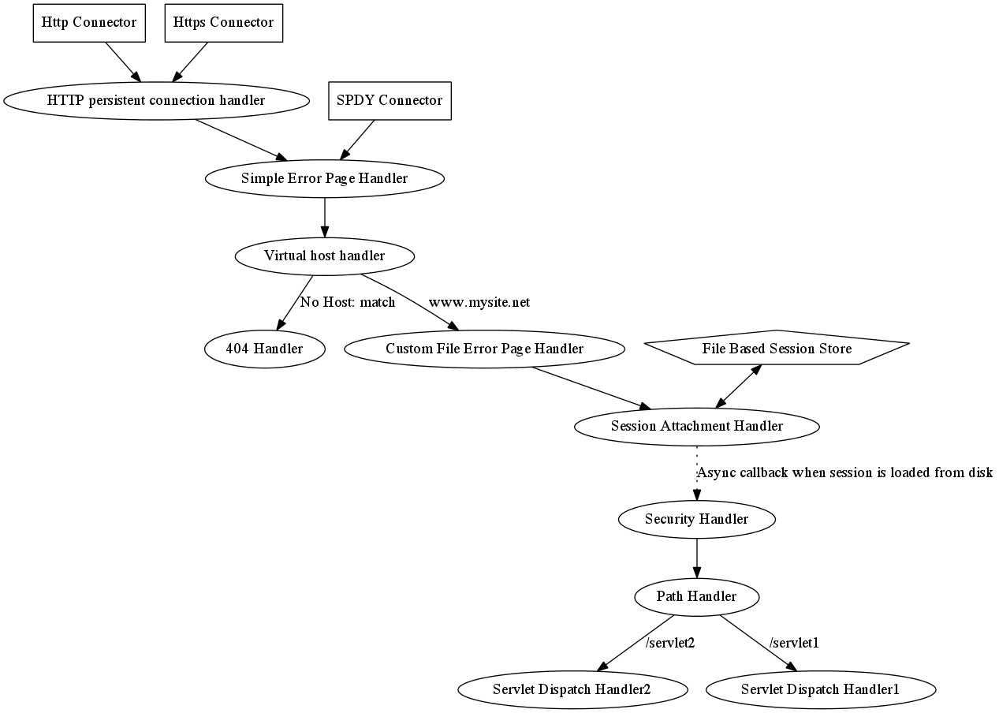

Undertow Design Document
========================
Stuart Douglas <sdouglas@redhat.com>
v0.1, 2012

This is the design document for the undertow web server. It covers general 
arcitecture and design considerations, it is not a requirements document.

Overview
--------
The core Undertow architecture is based on the concept of lightweight async handlers.

